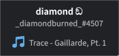

# dmpris



## Dependencies

- go (for building)
- playerctl (runtime)

## Usage

```sh
TOKEN="put token here" go run .
```

## Disclaimer

Obligatory user API not allowed, yadda yadda, Discord bad, use at your own risk.

## TODO

- [ ] Token grabber
